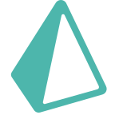

 

I'm **Duque** — CS & Cybersecurity student, full-stack developer, and open-source security contributor.  
I build with **Python** & **TypeScript** (Node, Next, Nest) and help secure projects by **reviewing & re-validating vulnerabilities** in the GitHub ecosystem.

---

## Highlights
- 🔐 **Application Security first**: OWASP Top 10 mindset, secure defaults, threat-modeling, SAST/DAST, and Code Review with security focus.  
- 🧪 **Vuln research & re-validation**: contributor in GitHub Security Advisories (triage/reviews), writing minimal PoCs and CVSS reasoning where appropriate.  
- 🧰 **Productivity & DX**: clean architecture, CI/CD, testing culture, typed APIs, and DevEx improvements that scale.  
- 🌌 **Astronomy nerd** who almost became an astrophysicist (that curiosity fuels my engineering).

---

## Tech Stack

| **Languages** | **Web & Frameworks** | **Platform & Data** |
|---|---|---|
|         |       |      |

### Security Toolbelt
**OWASP Top 10**, **CodeQL**, Semgrep, Burp Suite, ZAP, Nmap, Metasploit, Kali Linux, Linux hardening, JWT/OAuth2, CSP/Headers, SSRF/RCE/XSS prevention.
